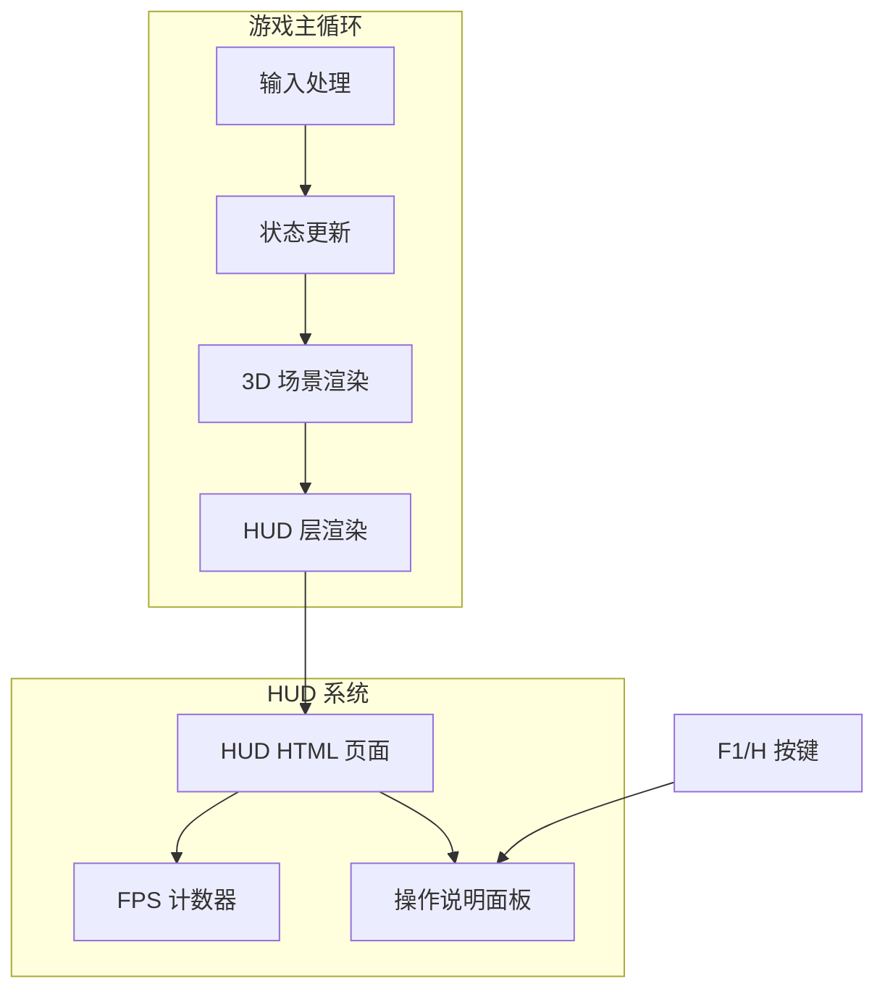

## Product Overview

在 Dong 引擎的 3d_screen_script.cpp 中添加 HUD UI 层，复用引擎现有的 HTML 页面渲染能力，实现游戏内信息叠加显示。

## Core Features

- **FPS 显示**：在屏幕左上角实时显示当前帧率
- **操作说明面板**：显示游戏操作指南，支持按 F1 或 H 键切换显示/隐藏
- **HUD 层管理**：使用 Dong 引擎渲染 HTML 页面作为 HUD 叠加层

## Tech Stack

- 游戏引擎：Dong 引擎（现有项目）
- HUD 渲染：引擎内置 HTML 页面渲染能力
- 开发语言：C++
- UI 层：HTML/CSS

## Tech Architecture

### System Architecture

复用 Dong 引擎现有的 HTML 页面渲染机制，在 3d_screen_script.cpp 中集成 HUD 层管理逻辑。



### Module Division

- **HUD 管理模块**：负责 HUD HTML 页面的加载、渲染和生命周期管理
- **FPS 计算模块**：计算并更新实时帧率数据
- **输入响应模块**：处理 F1/H 按键事件，切换操作说明显示状态

### Data Flow

1. 游戏循环每帧计算 FPS → 更新 HUD 数据
2. 用户按下 F1/H → 触发操作说明面板显示/隐藏
3. HUD HTML 页面接收数据更新 → 引擎渲染 HUD 叠加层

## Implementation Details

### Core Directory Structure

```
project-root/
├── src/
│   └── 3d_screen_script.cpp  # 修改：添加 HUD 管理逻辑
└── assets/
    └── hud/
        └── hud.html          # 新增：HUD HTML 页面
```

### Key Code Structures

**HUD 状态结构**：管理 HUD 显示状态和数据

```cpp
struct HUDState {
    bool showHelp = false;      // 操作说明显示状态
    float fps = 0.0f;           // 当前帧率
    float fpsUpdateTimer = 0.0f; // FPS 更新计时器
};
```

**HUD 管理接口**：

```cpp
class HUDManager {
public:
    void init();                    // 初始化 HUD HTML 页面
    void update(float deltaTime);   // 更新 FPS 等数据
    void handleInput(int key);      // 处理按键输入
    void toggleHelp();              // 切换操作说明显示
private:
    HUDState state;
};
```

### Technical Implementation Plan

1. **HUD HTML 页面创建**

- 创建 hud.html 文件，包含 FPS 显示区域和操作说明面板
- FPS 固定在左上角，操作说明居中或右下角显示
- 使用 CSS 实现透明背景和合适的字体样式

2. **HUD 管理器集成**

- 在 3d_screen_script.cpp 中添加 HUD 初始化和更新逻辑
- 复用引擎现有的 HTML 页面渲染 API

3. **FPS 计算与显示**

- 基于帧间隔时间计算实时 FPS
- 定期（如每 0.5 秒）更新显示值以避免数字跳动

4. **按键响应实现**

- 监听 F1 和 H 键事件
- 切换操作说明面板的显示/隐藏状态

## Agent Extensions

### SubAgent

- **code-explorer**
- Purpose：探索 Dong 引擎现有的 HTML 页面渲染机制和 3d_screen_script.cpp 的代码结构
- Expected outcome：找到引擎渲染 HTML 页面的 API 调用方式、输入处理机制以及合适的集成位置