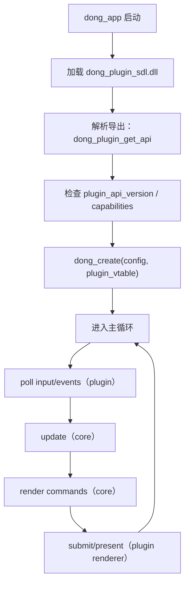

## Product Overview

以 CMake 为主对仓库进行分层重构：核心引擎产物为平台无关 `dong.dll`（对外仅暴露纯 C ABI）；平台相关能力封装为运行时加载插件 `dong_plugin_sdl.dll`，由 `dong_app` 负责装配并驱动运行；裁剪 demos/tests，并用自研 runner 跑通所有保留项。

## Core Features

- **平台无关核心库**：`dong.dll` 不引用 SDL/OS 相关库；对外提供稳定的 C ABI 入口与可版本化的数据结构。
- **运行时插件注入**：平台能力（renderer/log/input 等）通过 `dong_plugin_sdl.dll` 的 vtable 注入核心，实现可替换/可扩展。
- **应用装配层**：`dong_app` 负责动态加载插件、组装 vtable、创建窗口与主循环驱动，输出一致的日志与退出码。
- **demos/tests 分层裁剪**：必留 `3d_*`、`gpu_screenshot_demo`、`interactive_demo`；其余按最小集策略保留或移除，目录结构清晰分层。
- **自研 runner 统一执行**：runner 以统一命令行与报告格式运行全部保留 demo/test，汇总成功/失败与必要产物（如截图）。

## Tech Stack

- 构建系统：CMake（主构建入口与多目标编排）
- 语言：C/C++（核心对外 API 为纯 C ABI）
- 产物：`dong.dll`（core）、`dong_plugin_sdl.dll`（plugin）、`dong_app`（executable）、`dong_runner`（executable）

## Tech Architecture

### System Architecture

- 结构：core（平台无关） + plugin（平台相关） + app（装配与运行） + runner（统一执行与报告）
- 约束落实：
- `dong` **不做** OS 动态库加载；只接受外部注入的插件 vtable
- `dong_app` 负责 `LoadLibrary/dlopen`、符号查找、vtable 生命周期管理

```mermaid
flowchart LR
  subgraph Core["dong.dll（平台无关）"]
    CAPI["dong C ABI（dong.h）"]
    Engine["Engine 内部模块（pipeline/web/font/image/audio...）"]
    PluginIface["Plugin 接口（vtable structs + version）"]
    CAPI --> Engine
    Engine --> PluginIface
  end

  subgraph Plugin["dong_plugin_sdl.dll（平台相关）"]
    SDLImpl["SDL 实现：renderer/log/input/time/fs..."]
    SDLImpl --> "导出 dong_plugin_get_api()"
  end

  subgraph App["dong_app（装配/执行）"]
    Loader["动态加载器（OS API）"]
    Wire["注入 vtable 到 core"]
    Loop["主循环驱动（帧更新/渲染/事件）"]
    Loader --> Wire --> Loop
  end

  Demos["demos/tests（使用 dong C ABI）"] --> CAPI
  App --> Loader
  Loader --> Plugin
  Wire --> PluginIface
```

### Module Division

- **dong_core**：平台无关引擎实现；不包含 SDL/Win32/POSIX 头与库依赖
- **dong_capi**：对外 `extern "C"` API、错误码、句柄生命周期；保持 ABI 稳定
- **dong_plugin_api**：插件 vtable、版本协商、能力位（capabilities）与最小必需回调集合
- **dong_plugin_sdl**：SDL 驱动的 renderer/log/input 等实现；只在插件侧依赖 SDL
- **dong_app**：加载 `dong_plugin_sdl.dll`，注入 vtable，运行 demo/interactive 主循环
- **runner**：发现并执行保留 demos/tests；统一输出（console + 可选 JSON）；收集截图等产物

### Data Flow（初始化与帧循环）



## Implementation Details

### Core Directory Structure（仅展示新增/调整的关键路径）

```txt
project-root/
├── CMakeLists.txt
├── cmake/
│   └── dong_targets.cmake                  # 新/改：统一目标与导出规则
├── dong/
│   ├── include/
│   │   ├── dong.h                          # 新/改：纯 C ABI
│   │   └── dong_plugin_api.h               # 新：vtable + version 协商
│   └── src/
│       ├── core/                           # 改：移除 SDL 依赖的实现迁出
│       └── platform/                       # 改：仅保留抽象，不含具体平台
├── plugins/
│   └── sdl/
│       ├── CMakeLists.txt
│       └── src/                            # 新：SDL renderer/log/input 实现
├── apps/
│   └── dong_app/
│       ├── CMakeLists.txt
│       └── src/                            # 新/改：加载插件并注入 vtable
├── tools/
│   └── runner/
│       ├── CMakeLists.txt
│       └── src/                            # 新：自研 runner
├── demos/
│   ├── 3d_*/                               # 保留
│   ├── gpu_screenshot_demo/                # 保留
│   └── interactive_demo/                   # 保留
└── tests/
    └── ...                                 # 裁剪后保留最小集
```

### Key Code Structures（接口草案）

**1) 对外 C ABI（示意）**

```c
// dong.h
#ifdef __cplusplus
extern "C" {
#endif

typedef struct dong_context dong_context_t;

typedef enum dong_result {
  DONG_OK = 0,
  DONG_ERR_INVALID_ARG = 1,
  DONG_ERR_VERSION_MISMATCH = 2,
  DONG_ERR_PLUGIN_MISSING_CAP = 3,
  DONG_ERR_INTERNAL = 255
} dong_result_t;

typedef struct dong_create_desc {
  uint32_t api_version;
  void* user_data;
  const struct dong_plugin_vtable* plugin;   // 由 app 注入
} dong_create_desc_t;

dong_result_t dong_create(const dong_create_desc_t* desc, dong_context_t** out_ctx);
void dong_destroy(dong_context_t* ctx);
dong_result_t dong_tick(dong_context_t* ctx); // 单帧驱动（update+render）
uint32_t dong_get_api_version(void);

#ifdef __cplusplus
}
#endif
```

**2) 插件 vtable 与版本协商（示意）**

```c
// dong_plugin_api.h
typedef struct dong_plugin_info {
  uint32_t plugin_api_version;
  uint64_t capabilities; // bitmask: renderer/log/input/...
} dong_plugin_info_t;

typedef struct dong_plugin_vtable {
  dong_plugin_info_t info;

  // log
  void (*log)(void* user, int level, const char* msg);

  // input/events
  int  (*poll_event)(void* user, void* out_event);

  // renderer
  int  (*renderer_begin_frame)(void* user);
  int  (*renderer_submit)(void* user, const void* cmd_stream, size_t bytes);
  int  (*renderer_end_frame)(void* user);
} dong_plugin_vtable_t;

// 由插件导出；dong_app 动态加载并调用以获得 vtable
typedef const dong_plugin_vtable_t* (*dong_plugin_get_api_fn)(void);
```

### Technical Implementation Plan（关键点）

- **核心去平台化**：把 SDL/窗口/输入/日志等引用从 `dong` 内迁出到插件；core 仅依赖 `dong_plugin_vtable_t`。
- **ABI 稳定策略**：所有对外结构体携带 `api_version`；插件接口单独 `plugin_api_version`；不在 ABI 中暴露 C++ 类型。
- **Runner 执行一致性**：runner 以统一参数运行 demos/tests，校验退出码与产物（如截图文件存在与尺寸/哈希）。

### Testing Strategy

- 构建层：CMake 目标依赖关系与产物命名校验
- 运行层：runner 执行必留 demos/tests；断言退出码、日志关键字、截图产物（`gpu_screenshot_demo`）

## Agent Extensions

### SubAgent

- **code-explorer**
- Purpose: 跨目录检索现有 CMake/SDL 引用/目标依赖与 demo/test 清单，定位迁移点与可删项
- Expected outcome: 输出可执行的重构落点清单（文件路径、目标名、依赖边、需保留/移除列表）并降低漏改风险