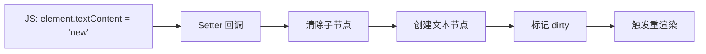

## Product Overview

修复自研游戏引擎中 DOM 元素的 textContent 属性实现问题。当前实现将 textContent 作为静态字符串值绑定，导致 JavaScript 代码修改 textContent 时无法正确更新底层 DOM 结构并触发重新渲染。

## Core Features

- 将 textContent 从静态属性改为 getter/setter 实现
- getter 返回当前 DOM 节点的文本内容
- setter 更新底层 DOM 并触发重新渲染
- 修复 HUD 帮助提示的可见性问题

## Tech Stack

- 语言: C++
- 绑定层: JavaScript Bindings (js_bindings.cpp)
- 引擎: 自研游戏引擎 DOM 实现

## Tech Architecture

### 问题定位

当前 `js_bindings.cpp` 第1170行将 textContent 设置为静态字符串值：

```cpp
// 当前实现（有问题）
obj->Set(context, "textContent", String::NewFromUtf8(...));
```

需要改为 getter/setter 模式，使 JS 修改能正确同步到底层 DOM。

### 解决方案

#### Getter 实现

- 遍历 DOM 节点的所有子节点
- 收集所有文本节点的内容
- 返回拼接后的字符串

#### Setter 实现

- 清除当前节点的所有子节点
- 创建新的文本节点并设置内容
- 将文本节点添加为子节点
- 标记节点为 dirty，触发重新渲染

### 数据流



## Implementation Details

### 修改文件

```
project-root/
├── src/
│   └── engine/
│       └── js_bindings.cpp    # 修改: textContent getter/setter 实现
```

### 关键代码结构

**Getter 回调函数**: 获取节点的文本内容

```cpp
void TextContentGetter(Local<String> property,
                       const PropertyCallbackInfo<Value>& info) {
    // 获取关联的 DOM 节点
    // 遍历子节点收集文本
    // 返回拼接结果
}
```

**Setter 回调函数**: 设置节点的文本内容并触发更新

```cpp
void TextContentSetter(Local<String> property,
                       Local<Value> value,
                       const PropertyCallbackInfo<void>& info) {
    // 获取关联的 DOM 节点
    // 清除所有子节点
    // 创建并添加文本节点
    // 标记节点 dirty
    // 触发重新渲染
}
```

**属性绑定**: 使用 SetAccessor 替代 Set

```cpp
obj->SetAccessor(context,
                 String::NewFromUtf8(isolate, "textContent"),
                 TextContentGetter,
                 TextContentSetter);
```

### 技术实现要点

1. 使用 V8 的 `SetAccessor` API 绑定 getter/setter
2. 在 setter 中正确管理 DOM 节点的生命周期
3. 确保 dirty 标记能正确传播到渲染管线
4. 处理 textContent 为空字符串的边界情况

## Agent Extensions

### SubAgent

- **code-explorer**
- Purpose: 探索引擎代码库，定位 js_bindings.cpp 中 textContent 的当前实现，以及 DOM 节点的 dirty 标记和重渲染触发机制
- Expected outcome: 找到需要修改的具体代码位置，理解现有的属性绑定模式和渲染更新机制