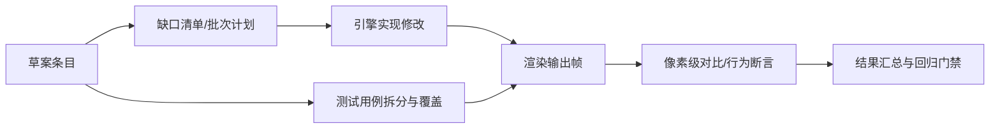
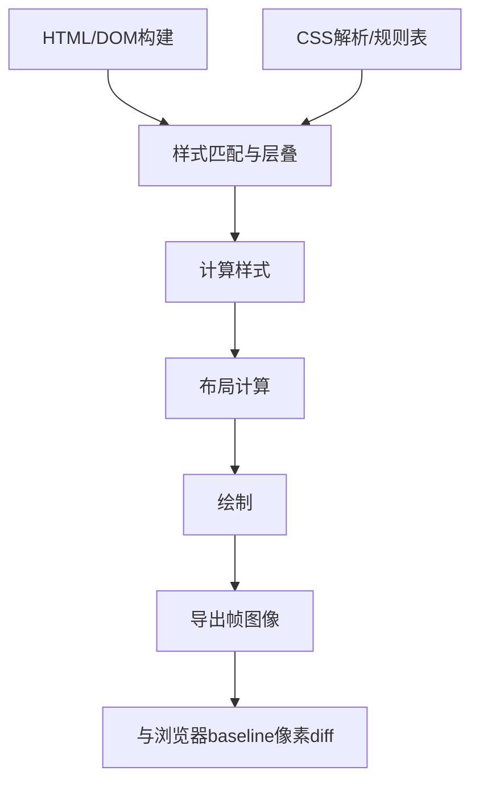

## Product Overview

基于 `doc/specific/html_css_dom_草案.md` 对当前引擎实现进行缺口统计，按批次补全 HTML/CSS/DOM/Layout 特性，并在 `examples/data/tests` 增加拆分后的覆盖用例。静态视觉特性以浏览器渲染结果为基线进行像素级一致性比对；动态特性优先提供可自动化的行为测试，无法自动化的输出人工复查清单。

## Core Features

- **草案对照缺口清单**：按章节/条目列出“已实现/部分实现/未实现/明确跳过”，并标注对应实现位置与验收方式。
- **CSS 特性补全（按批次）**：补齐草案宣称支持但缺入口的样式能力（含解析入口、样式表对象、计算样式可获取等），确保对渲染结果产生稳定、可验证的影响。
- **DOM/CSSOM 与选择器补全**：补齐常用样式表访问与规则增删、复杂选择器查询、计算样式获取等入口，保证脚本侧行为与渲染联动一致。
- **Layout/渲染一致性测试集**：将覆盖用例合理拆分为小而专的测试；每个静态视觉测试可导出 1–2 帧图像，并与浏览器 baseline 像素级一致；动态特性提供可运行断言或人工复查条目。

## Tech Stack

- 语言/工程形态：沿用现有 C++ 渲染引擎与 JS 绑定层；测试侧沿用现有 Python 工具链与数据驱动用例目录结构
- 验收工具链（按既有口径 2.a）：`html_render_test` 导帧 → `html_baseline_render.py` 生成浏览器基线 `base.png` → `vl_tool_multi.py --no-llm` 像素 diff

## Architecture Design

### System Architecture (existing-project aligned)



### Module Division (reuse current structure)

- **Spec Audit 模块**：从草案条目映射到代码入口、测试用例与验收方式；产出缺口表与批次清单  
- **CSS Parser & Style System**：属性解析表/初始值/继承与计算样式链路；补齐缺失属性入口（如 background-clip/origin/attachment 等）  
- **DOM/CSSOM & Selector Engine**：`document.styleSheets`、规则增删、选择器查询能力与复杂选择器支持面扩展  
- **JS Bindings**：将 DOM/CSSOM/Observer/ComputedStyle 等能力暴露到脚本侧，并保持与底层对象生命周期一致  
- **Layout & Paint**：确保新增样式/DOM 行为能在布局与绘制中产生可验证的输出  
- **Test Harness**：静态视觉用例基线生成与像素 diff；动态用例断言与不可测项清单输出

### Key Data Flow (CSS->Render)



## Implementation Details

### Focus Files (from requirement)

- `dong/src/layout/layout_engine.cpp`
- `dong/src/dom/html/*`
- `dong/src/dom/dom/*`
- `dong/src/dom/css/*`
- `dong/src/dom/js_bindings.cpp`（或同类绑定入口文件）

### Core Directory Structure (only new/modified)

```
dong/
├── doc/
│   └── specific/
│       └── html_css_dom_gapfill_report.md        # 新增：缺口清单与批次计划（可选放置）
├── examples/
│   └── data/
│       └── tests/
│           ├── css-background-clip/              # 新增：拆分后的静态视觉用例目录（示例）
│           ├── css-background-origin/
│           ├── css-background-attachment/
│           ├── dom-stylesheets-insertrule/
│           ├── dom-stylesheets-deleterule/
│           ├── dom-queryselector-complex/
│           └── css-getcomputedstyle/
└── src/
    └── dom/
        ├── css/                                  # 修改：属性入口/计算样式链路
        ├── dom/                                  # 修改：选择器/查询接口
        └── js_bindings.cpp                        # 修改：脚本侧暴露与一致性
```

## Technical Implementation Plan (by batches)

1) **缺口统计与分批冻结**

- Approach：以草案条目为索引，逐条定位“解析入口/对象模型入口/布局绘制影响/测试覆盖”，冻结批次范围，避免边做边扩  
- Testing：每条目绑定一种验收方式（像素 diff / 行为断言 / 人工复查）

2) **CSS 属性入口补齐（先从 background 系列示例）**

- Approach：补齐解析表与计算样式可达性，打通“样式声明→计算样式→绘制”的闭环  
- Testing：为每个属性建立最小可区分视觉用例，避免一个用例覆盖过多点导致回归定位困难

3) **DOM/CSSOM（styleSheets、insertRule/deleteRule、getComputedStyle）**

- Approach：补齐对象与方法语义、错误分支、更新触发（样式失效/重算/重绘），并确保脚本侧可观测  
- Testing：提供动态断言（规则数量/文本/应用结果），同时补一条静态视觉用例证明渲染生效

4) **复杂选择器 querySelector(All)**

- Approach：按草案覆盖面分层扩展选择器能力；对不支持项明确返回行为并记录到“跳过/不支持”  
- Testing：构造小型 DOM 树用例，断言命中集合与顺序，并加一条视觉用例验证样式选择生效

## Agent Extensions

### SubAgent

- **code-explorer**
- Purpose: 跨目录检索草案相关入口、定位缺失实现点与现有测试模式，输出可执行的缺口映射表
- Expected outcome: 形成“草案条目 → 代码入口/缺口类型/验收方式/对应测试目录”的清单，并支撑分批实施