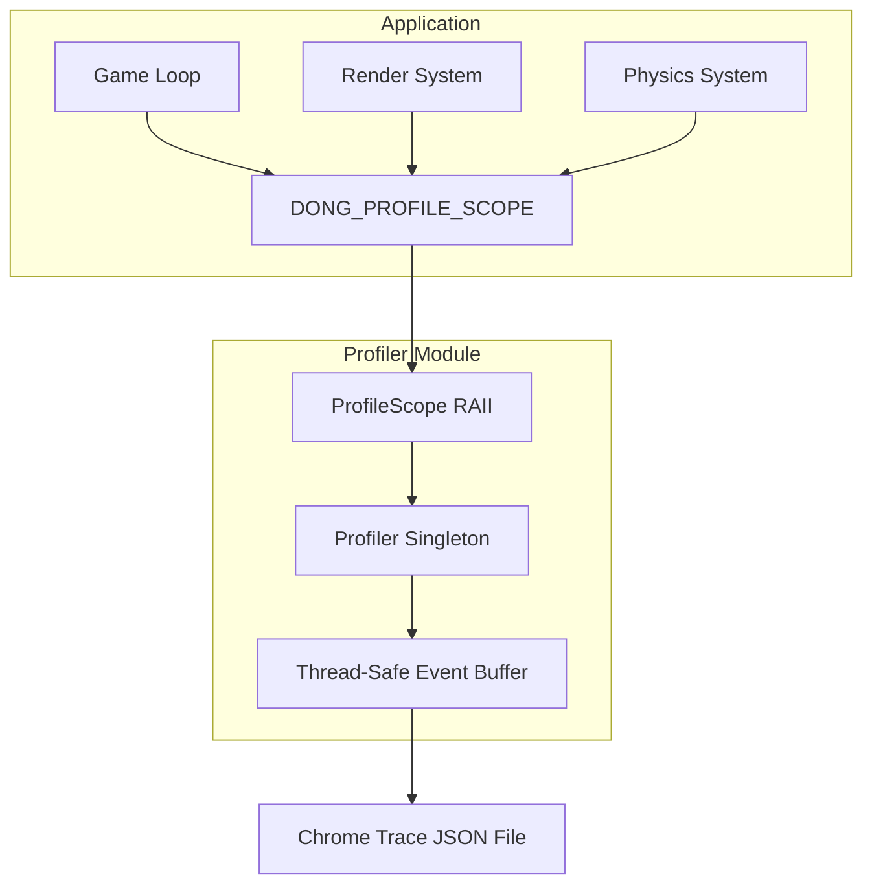

## Product Overview

将现有的性能分析宏从 `log.h` 重构为独立的 Profiler 模块，位于 `dong/src/core/profiler.h/.cpp`，支持多线程环境下的性能打点，并输出 Chrome Trace JSON 格式供 `chrome://tracing` 可视化分析。

## Core Features

- **RAII Scope 打点**：通过 RAII 机制自动记录代码块的开始和结束时间
- **多线程支持**：线程安全的事件收集，正确记录各线程的性能数据
- **Chrome Trace JSON 输出**：生成符合 Chrome Trace Event Format 的 JSON 文件
- **宏接口**：提供简洁的 `DONG_PROFILE_SCOPE`、`DONG_PROFILE_FUNCTION` 等宏
- **引擎埋点**：在主循环、渲染、物理更新等关键位置插入性能打点

## Tech Stack

- 语言：C++17
- 输出格式：Chrome Trace Event Format (JSON)
- 线程安全：`std::mutex` + thread-local 缓存优化

## Tech Architecture

### System Architecture



### Module Division

- **Profiler Core**：单例管理器，负责事件收集、线程同步、JSON 序列化
- **ProfileScope**：RAII 类，构造时记录开始，析构时记录结束
- **Macro Interface**：`DONG_PROFILE_SCOPE`、`DONG_PROFILE_FUNCTION` 等便捷宏

### Data Flow

1. 宏展开创建 `ProfileScope` 对象
2. 构造函数记录事件名称、线程ID、开始时间戳
3. 析构函数计算持续时间，将事件推入线程安全缓冲区
4. 程序结束或手动调用时，序列化为 Chrome Trace JSON

## Implementation Details

### Core Directory Structure

```
dong/src/core/
├── profiler.h      # Profiler 类声明、宏定义
└── profiler.cpp    # Profiler 实现、JSON 序列化
```

### Key Code Structures

**ProfileEvent 结构体**：存储单个性能事件的完整信息，包含事件名称、分类、线程ID、时间戳和持续时间。

```cpp
struct ProfileEvent {
    const char* name;
    const char* category;
    uint64_t threadId;
    uint64_t startTime;  // microseconds
    uint64_t duration;   // microseconds
};
```

**Profiler 单例类**：管理所有性能事件的收集和输出，提供线程安全的事件记录接口。

```cpp
class Profiler {
public:
    static Profiler& instance();
    void beginSession(const std::string& filepath);
    void endSession();
    void addEvent(const ProfileEvent& event);
private:
    std::mutex m_mutex;
    std::vector<ProfileEvent> m_events;
    std::ofstream m_outputFile;
    bool m_active = false;
};
```

**ProfileScope RAII 类**：自动管理性能区间的开始和结束，析构时自动提交事件。

```cpp
class ProfileScope {
public:
    ProfileScope(const char* name, const char* category = "default");
    ~ProfileScope();
private:
    const char* m_name;
    const char* m_category;
    uint64_t m_startTime;
};
```

**宏定义**：提供便捷的打点接口，支持编译期开关。

```cpp
#ifdef DONG_PROFILING_ENABLED
    #define DONG_PROFILE_SCOPE(name) ProfileScope scope##__LINE__(name)
    #define DONG_PROFILE_FUNCTION() DONG_PROFILE_SCOPE(__FUNCTION__)
#else
    #define DONG_PROFILE_SCOPE(name)
    #define DONG_PROFILE_FUNCTION()
#endif
```

### Technical Implementation Plan

**Chrome Trace JSON 格式**：

```
{
  "traceEvents": [
    {"name":"Update","cat":"engine","ph":"X","ts":1000,"dur":500,"pid":1,"tid":1},
    {"name":"Render","cat":"engine","ph":"X","ts":1500,"dur":800,"pid":1,"tid":2}
  ]
}
```

- `ph: "X"` 表示 Complete Event（包含 duration）
- `ts` 和 `dur` 单位为微秒
- `tid` 记录线程ID以支持多线程可视化

### Performance Optimization

- 使用 thread-local 缓冲减少锁竞争
- 预分配事件向量容量
- 使用 `std::chrono::high_resolution_clock` 获取高精度时间戳

## Agent Extensions

### SubAgent

- **code-explorer**
- Purpose：探索现有代码库，查找 `DONG_PERF_*` 宏的当前实现、引擎主循环位置、以及需要埋点的关键系统
- Expected outcome：获取现有性能宏定义、主循环结构、渲染/物理系统入口点的代码位置