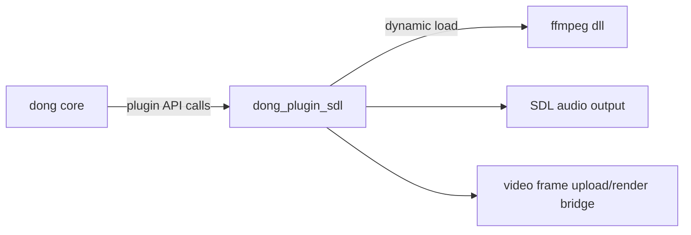
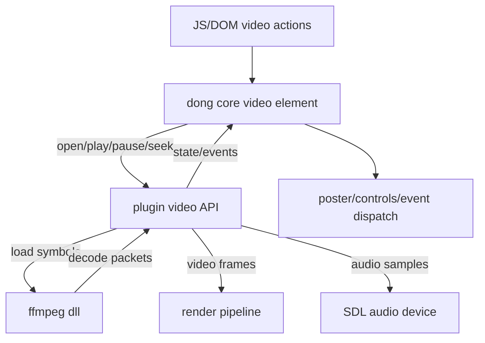

## Product Overview

通过扩展插件接口，让 `dong_plugin_sdl` 在不影响引擎核心依赖的前提下，为 `<video>` 提供解码与音频播放能力，并提供可验收示例与测试用例。

## Core Features

- **`<video>` 播放能力（由插件提供）**：支持加载本地视频资源，播放/暂停/停止、循环、静音、音量调节与播放进度控制；画面在渲染区域内稳定输出、音画同步。
- **更完整的交互与状态表现（P1 一并覆盖）**：支持 `poster` 首帧/封面展示、`controls` 默认控件展示与交互；在播放、暂停、结束、出错、加载等关键节点触发对应事件，页面可见状态与控件状态同步变化。
- **插件化隔离**：引擎核心仅通过插件接口访问“视频解码/音频输出”能力；缺少插件或加载失败时，页面给出可见的错误/降级表现（如显示 poster/错误提示，不崩溃）。
- **验收用例与自动化测试**：补齐 `examples/data/video` 的可运行示例页面与媒体数据组织；在 `examples/data/tests` 增加 feature 测试用例覆盖 poster/controls/事件/基础播放流程，形成可重复验收路径。

## Tech Stack

- 语言/构建：C/C++ + CMake（沿用现有工程）
- 插件：`dong_plugin_sdl` 动态加载视频解码 DLL
- 三方库：`dong/third_party/ffmpeg` 仅在插件侧编译与依赖（DLL）

## Tech Architecture

### System Architecture



### Module Division

- **Core / Plugin API 扩展**
- 职责：定义视频播放所需的最小接口（创建/销毁、打开资源、解码获取帧、音频拉取、事件回调、能力探测）
- 依赖：不新增对 FFmpeg 的链接；保持仅与插件 ABI 交互
- **`dong_plugin_sdl` Video Backend**
- 职责：实现 video backend；管理解码线程/队列、音画同步、错误上报；对外实现核心接口
- 依赖：运行时加载 FFmpeg DLL；复用现有 SDL 音频输出路径
- **FFmpeg DLL Build**
- 职责：在 CMake 流程中从 `dong/third_party/ffmpeg` 编译生成 DLL，并产物复制到插件可加载位置
- **Examples & Feature Tests**
- 职责：提供示例页面与媒体资源组织；提供可重复的 feature 测试脚本与断言点

### Data Flow (Playback)



## Implementation Details

### Core Directory Structure (modified/new only)

```text
dong/
├── third_party/
│   └── ffmpeg/                    # 仅插件侧编译为 DLL
├── plugins/
│   └── dong_plugin_sdl/
│       ├── src/
│       │   ├── video/             # 新增：video backend 实现
│       │   └── plugin_api_bind/   # 新增/修改：扩展接口绑定
│       └── CMakeLists.txt         # 修改：依赖/加载 ffmpeg dll 产物
├── examples/
│   └── data/
│       ├── video/                 # 补齐：示例页面+媒体组织
│       └── tests/                 # 补齐：feature 测试用例
└── CMakeLists.txt                 # 修改：ffmpeg dll 构建与产物分发（仅插件依赖）
```

### Key Code Structures (interfaces)

- **Video Backend Capability**

```cpp
struct DongVideoCaps {
  bool supported;
  bool hasPoster;
  bool hasControls;
};
```

- **Plugin Video API (core calls, plugin implements)**

```cpp
struct DongVideoBackendV1 {
  DongVideoCaps (*get_caps)();

  void* (*create)(const char* url);
  void  (*destroy)(void* handle);

  bool  (*set_poster)(void* handle, const char* posterUrl);
  bool  (*set_controls)(void* handle, bool enabled);

  bool  (*play)(void* handle);
  bool  (*pause)(void* handle);
  bool  (*seek_ms)(void* handle, int64_t ms);

  // pull-based audio/video for engine
  bool  (*read_video_frame)(void* handle, /*out*/DongVideoFrame* frame);
  int   (*read_audio_samples)(void* handle, /*out*/float* interleaved, int maxFrames);

  void  (*set_event_cb)(void* handle, DongVideoEventCB cb, void* user);
};
```

### Technical Implementation Plan (high level)

1. 扩展核心插件接口：定义可稳定演进的版本化 video backend API，并保持核心不引入三方链接。
2. 在 `dong_plugin_sdl` 实现 backend：负责动态加载 FFmpeg DLL、解码与队列、音画同步与事件回调。
3. CMake 接入：将 `dong/third_party/ffmpeg` 构建为 DLL，并确保仅插件目标依赖与运行时加载。
4. 示例与测试：构建 `examples/data/video` 验收页；在 `examples/data/tests` 增加 poster/controls/事件/播放流程测试。
5. 验证：无插件/加载失败/资源损坏等路径下，页面仍可见反馈且不崩溃。

### Testing Strategy

- Feature 测试覆盖：加载 poster、点击 controls 播放/暂停、事件顺序与次数、结束事件、错误事件、seek 后继续播放。
- 回归覆盖：插件缺失、FFmpeg DLL 缺失、视频文件不可读时的降级表现与错误码。

## Agent Extensions

### SubAgent

- **code-explorer**
- Purpose: 全仓检索现有插件接口、video WIP 文档与示例/测试框架位置，定位最小改动点
- Expected outcome: 输出关键文件清单、现有接口/数据流梳理、需要新增/修改的具体入口

### Skill

- **skill-creator**
- Purpose: 仅在需要沉淀“FFmpeg DLL 接入与插件 ABI 规范”到可复用技能时使用
- Expected outcome: 生成一份可复用的技能草案（如无需沉淀则不启用）