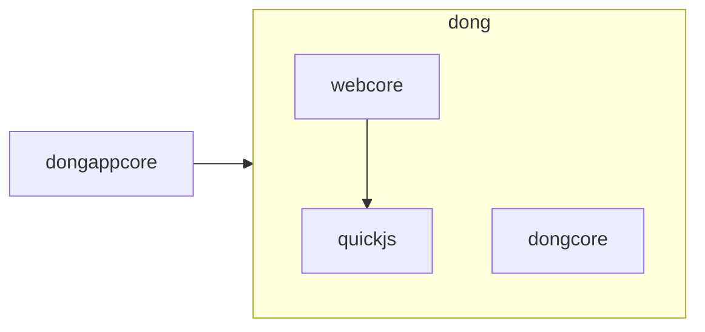

gwebappcore
- 可选。跨平台应用程序运行时。负责创建平台窗口，处理平台输入时间，运行应用程序时间循环，所有特定于平台的GPU代码。

dong
- 负责管理视图、高级渲染、输入转换、资源策略和事件分发

webcore
- 核心html/css布局引擎，负责解析资源、应用样式、计算布局，将结果转换为绘制节点树(在绘制期间，会遍历该树，转换为GPU命令列表，由GPUDriver或cpu光栅化器渲染)
- 使用lightml+客制的DOM等

dongcore
- 2d cpu&GPU 绘图库，负责底层图形例程(路径、字体、gpu命令列表、cpu光栅化、细分、图像缓存等)
- gpu使用sdl3