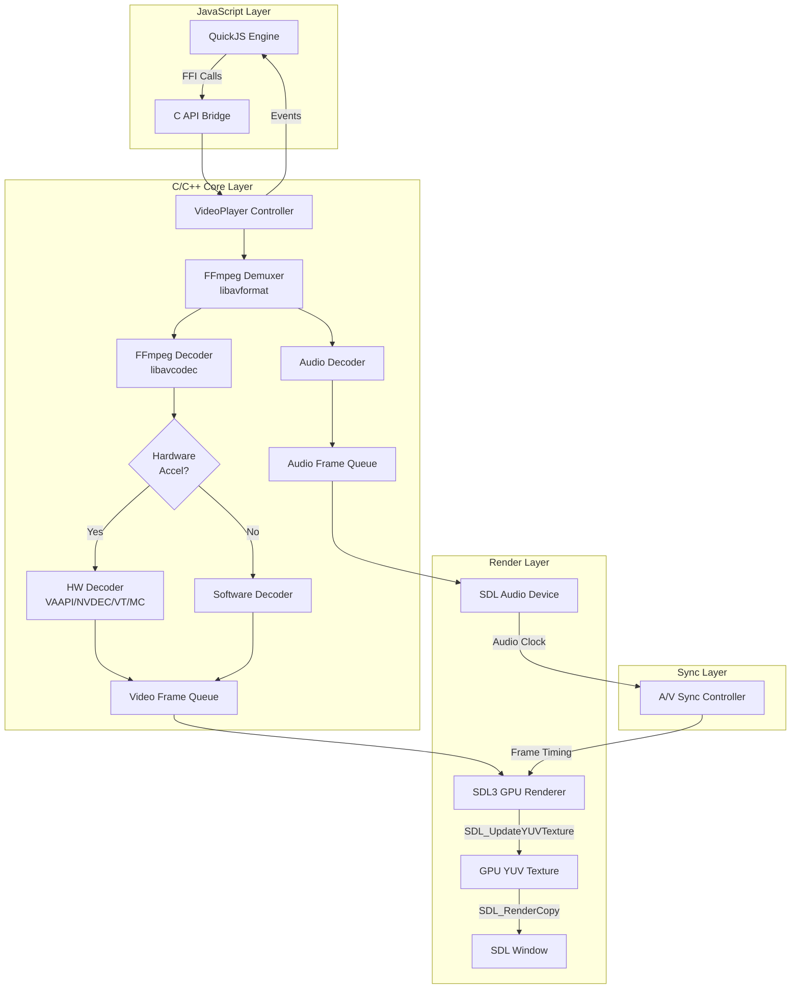

# 自研UI框架Video特性实现技术方案

## 1. 概述

### 1.1 技术栈与设计目标

本方案为不依赖WebView的自研UI框架提供Video特性的完整实现规范。框架采用以下核心技术栈：

|组件|技术选型|职责|
|---|---|---|
|图形后端|SDL GPU|窗口管理、GPU纹理渲染|
|脚本引擎|QuickJS|JavaScript执行、DOM API暴露|
|HTML/CSS解析|lexbor|`<video>`元素解析、样式计算|
|布局引擎|Yoga+自研|视频容器布局计算|
|视频解码|FFmpeg|音视频解封装、解码、硬件加速|
|字体渲染|FreeType+HarfBuzz+msdfgen|控制栏文字渲染|

### 1.2 设计原则

根据框架的核心设计原则，Video模块遵循以下约束：

- **声明式优先**：通过`<video>`标签及CSS属性声明视频展示方式，脚本层控制播放逻辑
- **强裁剪意识**：仅实现核心播放能力，不追求浏览器级DRM、MSE、EME支持
- **GPU驱动**：视频帧直接通过YUV纹理上传至GPU，避免CPU像素格式转换
- **可演进**：预留接口支持后续升级为完整MediaSource Extensions实现

## 2. Video元素HTML/CSS/DOM规范要求

### 2.1 HTML规范：`<video>`元素属性

基于WHATWG HTML Living Standard [1]，需支持以下属性：

|属性|类型|必要性|说明|
|---|---|---|---|
|`src`|DOMString|P0|视频资源URL|
|`poster`|DOMString|P1|视频封面图URL|
|`autoplay`|Boolean|P0|自动播放标志|
|`loop`|Boolean|P0|循环播放标志|
|`muted`|Boolean|P0|静音标志|
|`controls`|Boolean|P1|显示原生控制栏|
|`preload`|Enum|P1|预加载策略(none/metadata/auto)|
|`width`/`height`|Number|P0|视频容器尺寸|
|`crossorigin`|Enum|P2|跨域资源策略|
|`playsinline`|Boolean|P1|内联播放(移动端)|

lexbor已支持`<video>`元素解析，属性值可通过`lxb_dom_element_get_attribute()`获取 [2]。

### 2.2 CSS规范：视频样式属性

|属性|支持状态|实现方式|
|---|---|---|
|`object-fit`|✅支持|GPU着色器裁剪/缩放|
|`object-position`|✅支持|纹理UV坐标偏移|
|`aspect-ratio`|✅支持|Yoga布局计算|
|`visibility`|✅支持|跳过渲染提交|
|`opacity`|✅支持|纹理Alpha混合|
|`transform`|✅支持|GPU矩阵变换|
|`filter`|⚠️部分支持|仅brightness/contrast/saturate|
|`clip-path`|❌不支持|复杂度高|

`object-fit`实现映射关系：

```
contain  → 保持宽高比，完整显示，可能留黑边
cover    → 保持宽高比，填满容器，可能裁剪
fill     → 拉伸填满，不保持宽高比
none     → 原始尺寸，居中显示
scale-down → min(none, contain)
```

### 2.3 DOM规范：HTMLVideoElement接口

基于WHATWG DOM Standard [3]，需实现以下接口层级：

```
EventTarget
  └── Node
       └── Element
            └── HTMLElement
                 └── HTMLMediaElement
                      └── HTMLVideoElement
```

#### 2.3.1 HTMLMediaElement属性

|属性|类型|读写|说明|
|---|---|---|---|
|`currentTime`|double|R/W|当前播放位置(秒)|
|`duration`|double|R|媒体总时长(秒)|
|`paused`|boolean|R|是否暂停|
|`ended`|boolean|R|是否播放结束|
|`volume`|double|R/W|音量(0.0-1.0)|
|`muted`|boolean|R/W|是否静音|
|`playbackRate`|double|R/W|播放速率|
|`readyState`|unsigned short|R|就绪状态(0-4)|
|`networkState`|unsigned short|R|网络状态(0-3)|
|`buffered`|TimeRanges|R|已缓冲区间|
|`seeking`|boolean|R|是否正在seek|
|`videoWidth`|unsigned long|R|视频原始宽度|
|`videoHeight`|unsigned long|R|视频原始高度|

#### 2.3.2 HTMLMediaElement方法

|方法|返回值|说明|
|---|---|---|
|`play()`|Promise<void>|开始播放|
|`pause()`|void|暂停播放|
|`load()`|void|重新加载媒体|
|`canPlayType(type)`|DOMString|检测格式支持(""|"maybe"|"probably")|

#### 2.3.3 媒体事件

|事件|触发时机|携带数据|
|---|---|---|
|`loadstart`|开始加载|无|
|`loadedmetadata`|元数据加载完成|duration/videoWidth/videoHeight|
|`loadeddata`|首帧数据就绪|无|
|`canplay`|可以开始播放|无|
|`canplaythrough`|预计可不中断播放|无|
|`play`|播放开始|无|
|`pause`|播放暂停|无|
|`playing`|实际开始播放|无|
|`timeupdate`|播放位置更新|currentTime|
|`seeking`|开始seek|无|
|`seeked`|seek完成|无|
|`ended`|播放结束|无|
|`error`|发生错误|MediaError对象|
|`waiting`|等待数据|无|
|`volumechange`|音量变化|volume/muted|
|`ratechange`|播放速率变化|playbackRate|

## 3. 推荐方案：FFmpeg + SDL3 GPU集成

### 3.1 方案架构

基于技术调研结论，推荐采用FFmpeg作为解码核心，结合SDL3 GPU API实现视频渲染 [4]。



### 3.2 FFmpeg解码管线设计

FFmpeg核心组件及其职责 [5]：

|库|职责|关键API|
|---|---|---|
|libavformat|容器解封装|`avformat_open_input()`, `av_read_frame()`|
|libavcodec|编解码器|`avcodec_send_packet()`, `avcodec_receive_frame()`|
|libswscale|像素格式转换|`sws_scale()`（软解fallback时使用）|
|libavutil|工具函数|`av_frame_alloc()`, `av_hwdevice_ctx_create()`|
|libswresample|音频重采样|`swr_convert()`|

解码流程伪代码：

```c
// 1. 打开媒体文件
AVFormatContext* fmt_ctx = NULL;
avformat_open_input(&fmt_ctx, url, NULL, NULL);
avformat_find_stream_info(fmt_ctx, NULL);

// 2. 查找视频/音频流
int video_stream_idx = av_find_best_stream(fmt_ctx, AVMEDIA_TYPE_VIDEO, -1, -1, NULL, 0);
int audio_stream_idx = av_find_best_stream(fmt_ctx, AVMEDIA_TYPE_AUDIO, -1, -1, NULL, 0);

// 3. 初始化解码器（支持硬件加速）
AVCodecContext* video_dec_ctx = avcodec_alloc_context3(decoder);
if (hw_accel_enabled) {
    av_hwdevice_ctx_create(&hw_device_ctx, hw_type, NULL, NULL, 0);
    video_dec_ctx->hw_device_ctx = av_buffer_ref(hw_device_ctx);
}
avcodec_open2(video_dec_ctx, decoder, NULL);

// 4. 解码循环
AVPacket* pkt = av_packet_alloc();
AVFrame* frame = av_frame_alloc();
while (av_read_frame(fmt_ctx, pkt) >= 0) {
    if (pkt->stream_index == video_stream_idx) {
        avcodec_send_packet(video_dec_ctx, pkt);
        while (avcodec_receive_frame(video_dec_ctx, frame) >= 0) {
            // 将frame推入视频帧队列
            video_queue_push(frame);
        }
    }
    av_packet_unref(pkt);
}
```

### 3.3 硬件加速方案

各平台硬件解码方案对应表 [6][7][8]：

|平台|硬件加速API|FFmpeg hwaccel|支持编码格式|零拷贝机制|
|---|---|---|---|---|
|Linux (Intel/AMD)|VAAPI|`vaapi`|H.264/HEVC/VP9/AV1|DMA-BUF|
|Linux (NVIDIA)|NVDEC|`cuda`/`cuvid`|H.264/HEVC/VP9/AV1|CUDA-GL interop|
|macOS/iOS|VideoToolbox|`videotoolbox`|H.264/HEVC/ProRes|CVPixelBuffer|
|Android|MediaCodec|`mediacodec`|H.264/HEVC/VP9/AV1|Surface输出|
|Windows|DXVA2/D3D11VA|`dxva2`/`d3d11va`|H.264/HEVC|D3D纹理共享|

硬件加速初始化示例：

```c
enum AVHWDeviceType hw_type;
#if defined(__linux__) && !defined(__ANDROID__)
    hw_type = AV_HWDEVICE_TYPE_VAAPI;  // 或 CUDA
#elif defined(__APPLE__)
    hw_type = AV_HWDEVICE_TYPE_VIDEOTOOLBOX;
#elif defined(__ANDROID__)
    hw_type = AV_HWDEVICE_TYPE_MEDIACODEC;
#elif defined(_WIN32)
    hw_type = AV_HWDEVICE_TYPE_D3D11VA;
#endif

AVBufferRef* hw_device_ctx = NULL;
int ret = av_hwdevice_ctx_create(&hw_device_ctx, hw_type, NULL, NULL, 0);
if (ret < 0) {
    // Fallback to software decoding
}
```

## 4. SDL GPU纹理上传与渲染流程

### 4.1 纹理创建

SDL3支持直接创建YUV格式纹理，避免CPU进行色彩空间转换 [9]：

```c
// 创建YUV纹理（NV12或IYUV格式）
SDL_Texture* video_texture = SDL_CreateTexture(
    renderer,
    SDL_PIXELFORMAT_NV12,        // 或 SDL_PIXELFORMAT_IYUV
    SDL_TEXTUREACCESS_STREAMING, // 允许频繁更新
    video_width,
    video_height
);

// 设置纹理混合模式（支持透明度）
SDL_SetTextureBlendMode(video_texture, SDL_BLENDMODE_BLEND);
```

SDL支持的YUV像素格式：

|格式|SDL常量|平面数|说明|
|---|---|---|---|
|NV12|`SDL_PIXELFORMAT_NV12`|2|Y + 交错UV（硬解常用）|
|NV21|`SDL_PIXELFORMAT_NV21`|2|Y + 交错VU|
|I420/IYUV|`SDL_PIXELFORMAT_IYUV`|3|Y + U + V分离|
|YV12|`SDL_PIXELFORMAT_YV12`|3|Y + V + U分离|

### 4.2 YUV数据上传流程

使用`SDL_UpdateYUVTexture()`直接上传三平面YUV数据 [9]：

```c
void upload_frame_to_texture(SDL_Texture* texture, AVFrame* frame) {
    // 对于I420/IYUV格式
    if (frame->format == AV_PIX_FMT_YUV420P) {
        SDL_UpdateYUVTexture(
            texture,
            NULL,                    // 更新整个纹理
            frame->data[0],          // Y平面
            frame->linesize[0],      // Y行跨度
            frame->data[1],          // U平面
            frame->linesize[1],      // U行跨度
            frame->data[2],          // V平面
            frame->linesize[2]       // V行跨度
        );
    }
    // 对于NV12格式（硬解输出常见）
    else if (frame->format == AV_PIX_FMT_NV12) {
        SDL_UpdateNVTexture(
            texture,
            NULL,
            frame->data[0],          // Y平面
            frame->linesize[0],
            frame->data[1],          // UV交错平面
            frame->linesize[1]
        );
    }
}
```

### 4.3 渲染流程

```c
void render_video_frame(SDL_Renderer* renderer, SDL_Texture* texture, 
                        SDL_FRect* src_rect, SDL_FRect* dst_rect,
                        ObjectFit fit_mode) {
    SDL_FRect actual_src, actual_dst;
    
    // 根据object-fit计算实际渲染区域
    calculate_object_fit(src_rect, dst_rect, fit_mode, &actual_src, &actual_dst);
    
    // 渲染纹理
    SDL_RenderTexture(renderer, texture, &actual_src, &actual_dst);
}

// object-fit计算函数
void calculate_object_fit(SDL_FRect* src, SDL_FRect* dst, ObjectFit fit,
                          SDL_FRect* out_src, SDL_FRect* out_dst) {
    float src_ratio = src->w / src->h;
    float dst_ratio = dst->w / dst->h;
    
    switch (fit) {
        case OBJECT_FIT_CONTAIN:
            if (src_ratio > dst_ratio) {
                out_dst->w = dst->w;
                out_dst->h = dst->w / src_ratio;
            } else {
                out_dst->h = dst->h;
                out_dst->w = dst->h * src_ratio;
            }
            // 居中
            out_dst->x = dst->x + (dst->w - out_dst->w) / 2;
            out_dst->y = dst->y + (dst->h - out_dst->h) / 2;
            *out_src = *src;
            break;
            
        case OBJECT_FIT_COVER:
            // 裁剪源区域
            if (src_ratio > dst_ratio) {
                out_src->h = src->h;
                out_src->w = src->h * dst_ratio;
                out_src->x = (src->w - out_src->w) / 2;
                out_src->y = 0;
            } else {
                out_src->w = src->w;
                out_src->h = src->w / dst_ratio;
                out_src->x = 0;
                out_src->y = (src->h - out_src->h) / 2;
            }
            *out_dst = *dst;
            break;
            
        case OBJECT_FIT_FILL:
            *out_src = *src;
            *out_dst = *dst;
            break;
    }
}
```

### 4.4 零拷贝优化方案

在Linux平台，通过DMA-BUF实现硬件解码帧到GPU纹理的零拷贝传输 [10]：

```c
// 使用VAAPI硬件解码时的零拷贝路径
// 1. 从硬件解码帧获取DMA-BUF文件描述符
VASurfaceID va_surface = (VASurfaceID)(uintptr_t)frame->data[3];
VADRMPRIMESurfaceDescriptor prime_desc;
vaExportSurfaceHandle(va_display, va_surface,
                      VA_SURFACE_ATTRIB_MEM_TYPE_DRM_PRIME_2,
                      VA_EXPORT_SURFACE_READ_ONLY,
                      &prime_desc);

// 2. 通过EGL导入DMA-BUF创建EGLImage
EGLint attribs[] = {
    EGL_WIDTH, frame->width,
    EGL_HEIGHT, frame->height,
    EGL_LINUX_DRM_FOURCC_EXT, DRM_FORMAT_NV12,
    EGL_DMA_BUF_PLANE0_FD_EXT, prime_desc.objects[0].fd,
    EGL_DMA_BUF_PLANE0_OFFSET_EXT, prime_desc.layers[0].offset[0],
    EGL_DMA_BUF_PLANE0_PITCH_EXT, prime_desc.layers[0].pitch[0],
    // ... plane1 for UV
    EGL_NONE
};
EGLImage egl_image = eglCreateImageKHR(egl_display, EGL_NO_CONTEXT,
                                        EGL_LINUX_DMA_BUF_EXT, NULL, attribs);

// 3. 绑定EGLImage到OpenGL纹理
glBindTexture(GL_TEXTURE_EXTERNAL_OES, gl_texture);
glEGLImageTargetTexture2DOES(GL_TEXTURE_EXTERNAL_OES, egl_image);
```

## 5. 媒体控制API设计

### 5.1 C/C++核心接口设计

```c
// video_player.h
typedef struct VideoPlayer VideoPlayer;

typedef enum {
    VP_STATE_IDLE,
    VP_STATE_LOADING,
    VP_STATE_READY,
    VP_STATE_PLAYING,
    VP_STATE_PAUSED,
    VP_STATE_ENDED,
    VP_STATE_ERROR
} VideoPlayerState;

typedef enum {
    VP_EVENT_LOADSTART,
    VP_EVENT_LOADEDMETADATA,
    VP_EVENT_CANPLAY,
    VP_EVENT_PLAY,
    VP_EVENT_PAUSE,
    VP_EVENT_TIMEUPDATE,
    VP_EVENT_SEEKED,
    VP_EVENT_ENDED,
    VP_EVENT_ERROR,
    VP_EVENT_VOLUMECHANGE
} VideoPlayerEvent;

typedef struct {
    int video_width;
    int video_height;
    double duration;
    int has_audio;
    int has_video;
} VideoMetadata;

typedef void (*VideoEventCallback)(VideoPlayer* player, VideoPlayerEvent event, void* userdata);
typedef void (*VideoFrameCallback)(VideoPlayer* player, AVFrame* frame, void* userdata);

// 生命周期管理
VideoPlayer* video_player_create(void);
void video_player_destroy(VideoPlayer* player);

// 资源加载
int video_player_open(VideoPlayer* player, const char* url);
void video_player_close(VideoPlayer* player);

// 播放控制
int video_player_play(VideoPlayer* player);
void video_player_pause(VideoPlayer* player);
int video_player_seek(VideoPlayer* player, double time_seconds);
void video_player_set_loop(VideoPlayer* player, int loop);

// 属性访问
double video_player_get_current_time(VideoPlayer* player);
double video_player_get_duration(VideoPlayer* player);
int video_player_is_paused(VideoPlayer* player);
int video_player_is_ended(VideoPlayer* player);
VideoPlayerState video_player_get_state(VideoPlayer* player);
VideoMetadata video_player_get_metadata(VideoPlayer* player);

// 音量控制
void video_player_set_volume(VideoPlayer* player, double volume);
double video_player_get_volume(VideoPlayer* player);
void video_player_set_muted(VideoPlayer* player, int muted);
int video_player_is_muted(VideoPlayer* player);

// 播放速率
void video_player_set_playback_rate(VideoPlayer* player, double rate);
double video_player_get_playback_rate(VideoPlayer* player);

// 回调注册
void video_player_set_event_callback(VideoPlayer* player, VideoEventCallback cb, void* userdata);
void video_player_set_frame_callback(VideoPlayer* player, VideoFrameCallback cb, void* userdata);

// 格式支持检测
const char* video_player_can_play_type(const char* mime_type);
```

### 5.2 QuickJS FFI绑定方案

```c
// video_player_quickjs.c
static JSClassID js_video_player_class_id;

static JSValue js_video_player_ctor(JSContext* ctx, JSValueConst new_target,
                                     int argc, JSValueConst* argv) {
    VideoPlayer* player = video_player_create();
    if (!player) {
        return JS_EXCEPTION;
    }
    
    JSValue obj = JS_NewObjectClass(ctx, js_video_player_class_id);
    JS_SetOpaque(obj, player);
    return obj;
}

static void js_video_player_finalizer(JSRuntime* rt, JSValue val) {
    VideoPlayer* player = JS_GetOpaque(val, js_video_player_class_id);
    if (player) {
        video_player_destroy(player);
    }
}

// play() 方法 - 返回Promise
static JSValue js_video_player_play(JSContext* ctx, JSValueConst this_val,
                                     int argc, JSValueConst* argv) {
    VideoPlayer* player = JS_GetOpaque(this_val, js_video_player_class_id);
    if (!player) return JS_EXCEPTION;
    
    // 创建Promise
    JSValue resolving_funcs[2];
    JSValue promise = JS_NewPromiseCapability(ctx, resolving_funcs);
    
    // 存储resolve函数，在播放实际开始时调用
    player->js_play_resolve = JS_DupValue(ctx, resolving_funcs[0]);
    player->js_play_reject = JS_DupValue(ctx, resolving_funcs[1]);
    player->js_ctx = ctx;
    
    int ret = video_player_play(player);
    if (ret < 0) {
        JSValue error = JS_NewError(ctx);
        JS_Call(ctx, resolving_funcs[1], JS_UNDEFINED, 1, &error);
        JS_FreeValue(ctx, error);
    }
    
    JS_FreeValue(ctx, resolving_funcs[0]);
    JS_FreeValue(ctx, resolving_funcs[1]);
    return promise;
}

// currentTime getter/setter
static JSValue js_video_player_get_current_time(JSContext* ctx, JSValueConst this_val) {
    VideoPlayer* player = JS_GetOpaque(this_val, js_video_player_class_id);
    return JS_NewFloat64(ctx, video_player_get_current_time(player));
}

static JSValue js_video_player_set_current_time(JSContext* ctx, JSValueConst this_val,
                                                 JSValueConst val) {
    VideoPlayer* player = JS_GetOpaque(this_val, js_video_player_class_id);
    double time;
    JS_ToFloat64(ctx, &time, val);
    video_player_seek(player, time);
    return JS_UNDEFINED;
}

// 属性定义表
static const JSCFunctionListEntry js_video_player_proto_funcs[] = {
    JS_CFUNC_DEF("play", 0, js_video_player_play),
    JS_CFUNC_DEF("pause", 0, js_video_player_pause),
    JS_CFUNC_DEF("load", 0, js_video_player_load),
    JS_CFUNC_DEF("canPlayType", 1, js_video_player_can_play_type),
    JS_CGETSET_DEF("currentTime", js_video_player_get_current_time, js_video_player_set_current_time),
    JS_CGETSET_DEF("duration", js_video_player_get_duration, NULL),
    JS_CGETSET_DEF("paused", js_video_player_get_paused, NULL),
    JS_CGETSET_DEF("ended", js_video_player_get_ended, NULL),
    JS_CGETSET_DEF("volume", js_video_player_get_volume, js_video_player_set_volume),
    JS_CGETSET_DEF("muted", js_video_player_get_muted, js_video_player_set_muted),
    JS_CGETSET_DEF("playbackRate", js_video_player_get_playback_rate, js_video_player_set_playback_rate),
    JS_CGETSET_DEF("readyState", js_video_player_get_ready_state, NULL),
    JS_CGETSET_DEF("videoWidth", js_video_player_get_video_width, NULL),
    JS_CGETSET_DEF("videoHeight", js_video_player_get_video_height, NULL),
    JS_CGETSET_DEF("src", js_video_player_get_src, js_video_player_set_src),
};
```

### 5.3 JavaScript API设计

对标HTMLVideoElement接口，在QuickJS中暴露以下API：

```javascript
// 用户侧使用示例
const video = document.querySelector('video');

// 属性访问
video.src = 'https://example.com/video.mp4';
video.volume = 0.8;
video.muted = false;
video.playbackRate = 1.5;
video.currentTime = 30; // seek到30秒

// 只读属性
console.log(video.duration);      // 总时长
console.log(video.paused);        // 是否暂停
console.log(video.ended);         // 是否结束
console.log(video.readyState);    // 就绪状态
console.log(video.videoWidth);    // 原始宽度
console.log(video.videoHeight);   // 原始高度

// 方法调用
video.play().then(() => {
    console.log('Playback started');
}).catch(err => {
    console.error('Playback failed:', err);
});

video.pause();
video.load();

const support = video.canPlayType('video/mp4; codecs="avc1.42E01E"');
// 返回 "", "maybe", 或 "probably"

// 事件监听
video.addEventListener('loadedmetadata', () => {
    console.log(`Video size: ${video.videoWidth}x${video.videoHeight}`);
    console.log(`Duration: ${video.duration}s`);
});

video.addEventListener('timeupdate', () => {
    console.log(`Current time: ${video.currentTime}s`);
});

video.addEventListener('ended', () => {
    console.log('Playback finished');
});

video.addEventListener('error', (e) => {
    console.error('Error:', e.target.error.message);
});
```

### 5.4 事件回调机制设计

```c
// 事件分发架构
typedef struct {
    VideoPlayerEvent type;
    VideoPlayer* target;
    double timestamp;
    union {
        struct { int code; char message[256]; } error;
        struct { double current_time; } timeupdate;
        struct { double volume; int muted; } volumechange;
    } data;
} VideoEvent;

// 事件队列（线程安全）
typedef struct {
    VideoEvent* events;
    int capacity;
    int head;
    int tail;
    pthread_mutex_t mutex;
    pthread_cond_t cond;
} VideoEventQueue;

// C层事件回调 -> 推入事件队列
static void on_video_event(VideoPlayer* player, VideoPlayerEvent event, void* userdata) {
    VideoEventQueue* queue = (VideoEventQueue*)userdata;
    
    VideoEvent ev = {
        .type = event,
        .target = player,
        .timestamp = get_current_time_ms()
    };
    
    // 填充事件数据
    switch (event) {
        case VP_EVENT_TIMEUPDATE:
            ev.data.timeupdate.current_time = video_player_get_current_time(player);
            break;
        case VP_EVENT_VOLUMECHANGE:
            ev.data.volumechange.volume = video_player_get_volume(player);
            ev.data.volumechange.muted = video_player_is_muted(player);
            break;
        // ...
    }
    
    event_queue_push(queue, &ev);
}

// 主线程事件处理（与QuickJS在同一线程）
void process_video_events(JSContext* ctx, VideoEventQueue* queue) {
    VideoEvent ev;
    while (event_queue_try_pop(queue, &ev)) {
        // 构造JS事件对象
        JSValue js_event = JS_NewObject(ctx);
        JS_SetPropertyStr(ctx, js_event, "type", 
                          JS_NewString(ctx, event_type_to_string(ev.type)));
        JS_SetPropertyStr(ctx, js_event, "target", 
                          get_js_video_element(ctx, ev.target));
        
        // 分发到JS监听器
        dispatch_event_to_js(ctx, ev.target, ev.type, js_event);
        JS_FreeValue(ctx, js_event);
    }
}
```

## 6. 音视频同步方案

### 6.1 PTS/DTS时间戳机制

FFmpeg解码后的AVFrame包含精确时间戳信息 [11]：

|字段|类型|说明|
|---|---|---|
|`pts`|int64_t|显示时间戳（Presentation Time Stamp）|
|`pkt_dts`|int64_t|解码时间戳（Decode Time Stamp）|
|`best_effort_timestamp`|int64_t|最佳估计时间戳|
|`time_base`|AVRational|时间基准（用于转换为秒）|

时间戳转换：

```c
// 将pts转换为秒
double pts_to_seconds(int64_t pts, AVRational time_base) {
    return pts * av_q2d(time_base);
}

// 获取帧的显示时间
double get_frame_pts(AVFrame* frame, AVStream* stream) {
    int64_t pts = frame->best_effort_timestamp;
    if (pts == AV_NOPTS_VALUE) {
        pts = frame->pts;
    }
    if (pts == AV_NOPTS_VALUE) {
        pts = 0;
    }
    return pts_to_seconds(pts, stream->time_base);
}
```

### 6.2 主时钟策略

采用**音频时钟为主**的同步策略，因为人耳对音频不连续比眼睛对视频卡顿更敏感 [11]：

```c
typedef struct {
    double pts;           // 当前播放位置（秒）
    double pts_drift;     // pts与系统时间的差值
    double last_updated;  // 上次更新的系统时间
    int paused;
} Clock;

// 音频时钟更新（每次音频回调时）
void update_audio_clock(Clock* clock, double pts) {
    double time = get_system_time();
    clock->pts = pts;
    clock->pts_drift = pts - time;
    clock->last_updated = time;
}

// 获取当前音频时钟时间
double get_audio_clock(Clock* clock) {
    if (clock->paused) {
        return clock->pts;
    }
    double time = get_system_time();
    return clock->pts_drift + time;
}
```

### 6.3 同步算法

视频渲染根据音频时钟决定帧显示策略：

```c
#define AV_SYNC_THRESHOLD_MIN 0.04   // 40ms
#define AV_SYNC_THRESHOLD_MAX 0.1    // 100ms
#define AV_SYNC_FRAMEDUP_THRESHOLD 0.1
#define AV_NOSYNC_THRESHOLD 10.0     // 超过10秒认为无法同步

typedef enum {
    SYNC_DISPLAY,      // 正常显示
    SYNC_SKIP,         // 跳过该帧（视频落后太多）
    SYNC_REPEAT,       // 重复上一帧（视频超前）
} SyncAction;

SyncAction compute_sync_action(double video_pts, Clock* audio_clock, 
                                double last_frame_duration) {
    double audio_pts = get_audio_clock(audio_clock);
    double diff = video_pts - audio_pts;
    
    // 差异太大，放弃同步
    if (fabs(diff) > AV_NOSYNC_THRESHOLD) {
        return SYNC_DISPLAY;
    }
    
    // 动态计算同步阈值
    double sync_threshold = FFMAX(AV_SYNC_THRESHOLD_MIN,
                                   FFMIN(AV_SYNC_THRESHOLD_MAX, last_frame_duration));
    
    if (diff < -sync_threshold) {
        // 视频落后于音频，跳帧
        return SYNC_SKIP;
    } else if (diff > sync_threshold) {
        // 视频超前于音频，等待/重复
        return SYNC_REPEAT;
    }
    
    return SYNC_DISPLAY;
}

// 视频渲染主循环
void video_render_loop(VideoPlayer* player) {
    AVFrame* frame = NULL;
    double last_frame_duration = 1.0 / 30.0; // 默认30fps
    
    while (!player->quit) {
        // 从队列取帧
        frame = video_queue_pop(player->video_queue);
        if (!frame) continue;
        
        double video_pts = get_frame_pts(frame, player->video_stream);
        SyncAction action = compute_sync_action(video_pts, &player->audio_clock, 
                                                 last_frame_duration);
        
        switch (action) {
            case SYNC_DISPLAY:
                upload_frame_to_texture(player->texture, frame);
                player->current_time = video_pts;
                fire_event(player, VP_EVENT_TIMEUPDATE);
                last_frame_duration = frame->duration * av_q2d(player->video_stream->time_base);
                break;
                
            case SYNC_SKIP:
                // 跳过该帧，立即取下一帧
                av_frame_unref(frame);
                continue;
                
            case SYNC_REPEAT:
                // 等待一段时间后重试
                SDL_Delay((int)((video_pts - get_audio_clock(&player->audio_clock)) * 1000));
                break;
        }
        
        av_frame_unref(frame);
    }
}
```

## 7. 线程模型设计

### 7.1 线程架构

|线程|职责|优先级|
|---|---|---|
|主线程|QuickJS执行、事件分发、UI渲染|Normal|
|解码线程|FFmpeg解封装、视频解码|High|
|音频解码线程|音频解码、重采样|High|
|音频播放线程|SDL音频回调|Realtime|

```
┌─────────────────────────────────────────────────────────────────┐
│                         Main Thread                              │
│  ┌──────────────┐  ┌──────────────┐  ┌────────────────────────┐ │
│  │   QuickJS    │  │  Event Loop  │  │   SDL Render Loop      │ │
│  │   Engine     │←→│  Dispatch    │←→│   (Video Frame Draw)   │ │
│  └──────────────┘  └──────────────┘  └────────────────────────┘ │
│         ↑                  ↑                    ↑                │
└─────────│──────────────────│────────────────────│────────────────┘
          │                  │                    │
    Event Queue         Video Frame          Render Texture
          │              Queue                    │
          │                  ↑                    │
┌─────────│──────────────────│────────────────────│────────────────┐
│         ↓                  │                    ↓                │
│  ┌──────────────┐  ┌──────────────┐  ┌────────────────────────┐ │
│  │ Video Decode │→→│ Frame Queue  │  │    Audio Clock Sync    │ │
│  │    Thread    │  │ (Ring Buffer)│  │                        │ │
│  └──────────────┘  └──────────────┘  └────────────────────────┘ │
│                                                ↑                 │
│                    Decode Threads              │                 │
└────────────────────────────────────────────────│─────────────────┘
                                                 │
┌────────────────────────────────────────────────│─────────────────┐
│  ┌──────────────┐  ┌──────────────┐            │                 │
│  │ Audio Decode │→→│ Audio Queue  │→→ SDL Audio Callback         │
│  │    Thread    │  │ (Ring Buffer)│            ↑                 │
│  └──────────────┘  └──────────────┘     Audio Thread            │
│                                                                  │
└──────────────────────────────────────────────────────────────────┘
```

### 7.2 线程安全队列设计

```c
// 无锁环形缓冲区（单生产者单消费者场景）
typedef struct {
    AVFrame** frames;
    int capacity;
    _Atomic int head;  // 写位置
    _Atomic int tail;  // 读位置
} FrameQueue;

FrameQueue* frame_queue_create(int capacity) {
    FrameQueue* q = malloc(sizeof(FrameQueue));
    q->frames = calloc(capacity, sizeof(AVFrame*));
    q->capacity = capacity;
    atomic_init(&q->head, 0);
    atomic_init(&q->tail, 0);
    return q;
}

int frame_queue_push(FrameQueue* q, AVFrame* frame) {
    int head = atomic_load(&q->head);
    int next_head = (head + 1) % q->capacity;
    
    // 队列满
    if (next_head == atomic_load(&q->tail)) {
        return -1;
    }
    
    q->frames[head] = av_frame_clone(frame);
    atomic_store(&q->head, next_head);
    return 0;
}

AVFrame* frame_queue_pop(FrameQueue* q) {
    int tail = atomic_load(&q->tail);
    
    // 队列空
    if (tail == atomic_load(&q->head)) {
        return NULL;
    }
    
    AVFrame* frame = q->frames[tail];
    q->frames[tail] = NULL;
    atomic_store(&q->tail, (tail + 1) % q->capacity);
    return frame;
}

int frame_queue_size(FrameQueue* q) {
    int head = atomic_load(&q->head);
    int tail = atomic_load(&q->tail);
    return (head - tail + q->capacity) % q->capacity;
}
```

### 7.3 QuickJS事件调度

由于QuickJS不是线程安全的，所有JS调用必须在主线程执行：

```c
// 跨线程事件投递（使用SDL自定义事件）
#define SDL_EVENT_VIDEO_PLAYER (SDL_EVENT_USER + 1)

typedef struct {
    VideoPlayer* player;
    VideoPlayerEvent event_type;
    void* event_data;
} VideoEventPayload;

// 从解码线程投递事件
void post_event_to_main_thread(VideoPlayer* player, VideoPlayerEvent type, void* data) {
    VideoEventPayload* payload = malloc(sizeof(VideoEventPayload));
    payload->player = player;
    payload->event_type = type;
    payload->event_data = data;
    
    SDL_Event event;
    event.type = SDL_EVENT_VIDEO_PLAYER;
    event.user.data1 = payload;
    SDL_PushEvent(&event);
}

// 主线程事件循环处理
void handle_sdl_events(JSContext* ctx) {
    SDL_Event event;
    while (SDL_PollEvent(&event)) {
        switch (event.type) {
            case SDL_EVENT_VIDEO_PLAYER: {
                VideoEventPayload* payload = event.user.data1;
                dispatch_js_video_event(ctx, payload->player, 
                                        payload->event_type, payload->event_data);
                free(payload);
                break;
            }
            // ... 其他事件处理
        }
    }
}

// 分发JS事件
void dispatch_js_video_event(JSContext* ctx, VideoPlayer* player,
                              VideoPlayerEvent type, void* data) {
    JSValue js_player = get_js_video_element(ctx, player);
    if (JS_IsUndefined(js_player)) return;
    
    const char* event_name = event_type_to_string(type);
    JSValue listeners = JS_GetPropertyStr(ctx, js_player, "_listeners");
    JSValue type_listeners = JS_GetPropertyStr(ctx, listeners, event_name);
    
    if (JS_IsArray(ctx, type_listeners)) {
        JSValue js_event = create_js_event(ctx, type, data);
        int len = JS_GetArrayLength(ctx, type_listeners);
        for (int i = 0; i < len; i++) {
            JSValue listener = JS_GetPropertyUint32(ctx, type_listeners, i);
            JS_Call(ctx, listener, js_player, 1, &js_event);
            JS_FreeValue(ctx, listener);
        }
        JS_FreeValue(ctx, js_event);
    }
    
    JS_FreeValue(ctx, type_listeners);
    JS_FreeValue(ctx, listeners);
    JS_FreeValue(ctx, js_player);
}
```

## 8. 实现路线图与优先级

### 8.1 P0：基础播放能力（4-6周）

|任务|描述|依赖|
|---|---|---|
|FFmpeg集成|编译FFmpeg静态库，集成到Zig Build|无|
|软件解码|实现libavcodec软解码管线|FFmpeg集成|
|YUV纹理渲染|SDL3 YUV纹理创建与上传|软件解码|
|基础播放控制|play/pause/seek实现|YUV渲染|
|音频播放|SDL Audio设备初始化，PCM输出|FFmpeg集成|
|基础同步|音频主时钟，简单丢帧策略|音频播放|
|QuickJS绑定|基础属性和方法绑定|播放控制|

**P0交付物：** 可播放本地mp4文件，支持play/pause/seek，具备基础音视频同步。

### 8.2 P1：硬件加速与稳定性（6-8周）

|任务|描述|依赖|
|---|---|---|
|VAAPI集成|Linux硬件解码支持|P0完成|
|VideoToolbox集成|macOS/iOS硬件解码支持|P0完成|
|零拷贝优化|DMA-BUF纹理导入（Linux）|VAAPI集成|
|错误处理|网络错误、格式错误处理|P0完成|
|事件系统|完整的HTMLMediaElement事件|QuickJS绑定|
|poster支持|视频封面图显示|P0完成|
|controls UI|原生播放控制栏渲染|P0完成|

**P1交付物：** 支持主流平台硬件加速，完整事件系统，原生控制栏。

### 8.3 P2：高级特性（8-12周）

|任务|描述|依赖|
|---|---|---|
|Android MediaCodec|Android硬件解码支持|P1完成|
|Windows D3D11VA|Windows硬件解码支持|P1完成|
|网络流媒体|HTTP/HTTPS流播放|P1完成|
|HLS支持|m3u8解析，分片加载|网络流媒体|
|字幕支持|SRT/VTT字幕解析渲染|P1完成|
|画中画|PiP窗口支持|P1完成|
|全屏|全屏切换API|P1完成|

**P2交付物：** 全平台硬件加速，流媒体支持，字幕功能。

### 8.4 里程碑计划

```
2026 Q1: P0基础播放能力
         ├── Week 1-2: FFmpeg集成与软解码
         ├── Week 3-4: SDL3渲染与音频播放
         └── Week 5-6: QuickJS绑定与基础同步

2026 Q2: P1硬件加速与稳定性
         ├── Week 1-4: VAAPI/VideoToolbox集成
         ├── Week 5-6: 零拷贝优化
         └── Week 7-8: 事件系统与控制栏

2026 Q3: P2高级特性
         ├── Week 1-4: Android/Windows硬件加速
         ├── Week 5-8: 网络流媒体与HLS
         └── Week 9-12: 字幕与高级功能
```

## 9. 参考文献

[1] WHATWG. HTML Living Standard. https://html.spec.whatwg.org/multipage/

[2] lexbor. Fast HTML5 parser and CSS parser. https://github.com/nickolaysm/lexbor

[3] WHATWG. DOM Living Standard. https://dom.spec.whatwg.org/

[4] rambod-rahmani/ffmpeg-video-player. An FFmpeg and SDL Tutorial. https://github.com/rambod-rahmani/ffmpeg-video-player

[5] dranger.com. An ffmpeg and SDL Tutorial. http://dranger.com/ffmpeg/ffmpegtutorial_all.html

[6] ArchWiki, 2025-12-23. Hardware video acceleration. https://wiki.archlinux.org/title/Hardware_video_acceleration

[7] chromium.googlesource.com. Chromium Media. https://chromium.googlesource.com/chromium/src/+/HEAD/media/README.md

[8] Apple Developer Documentation. VideoToolbox Framework. https://developer.apple.com/documentation/videotoolbox

[9] SDL Wiki. SDL_UpdateYUVTexture. https://wiki.libsdl.org/SDL3/SDL_UpdateYUVTexture

[10] Igalia, 2019-02-26. GStreamer and DMA-BUF. https://blogs.igalia.com/magomez/2019/02

[11] dranger.com. FFmpeg Tutorial - Audio/Video Synchronization. http://dranger.com/ffmpeg/tutorial05.html